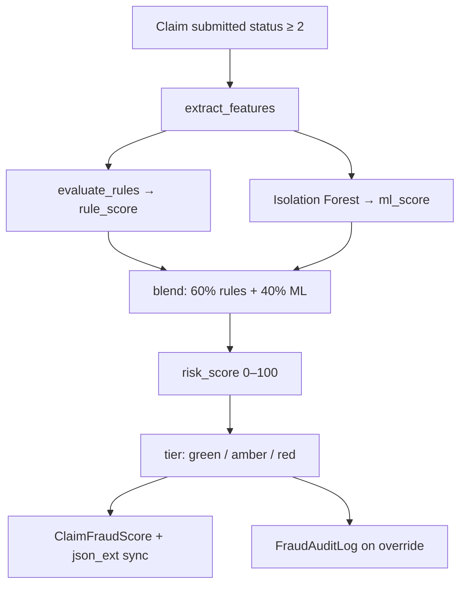

# ClaimGuard — Backend Module

[](https://www.gnu.org/licenses/agpl-3.0)
[](https://openimis.org)
[](https://www.python.org/)
[](https://github.com/Nosh-thee-techy/openimis-be-claimguard_py/releases/tag/v1.0-hackathon)

**Technikali** · openIMIS Hackathon  
**Track 3** — Claims Management & Fraud Detection  
**Cross-tracks:** Track 5 (AI & Emerging Tech) · Track 1 (Innovation)

> Django module that scores every submitted claim (0–100) using deterministic fraud rules and an Isolation Forest ML model — exposed via REST API and GraphQL, with full audit logging.

---

## Table of contents

- [Problem & solution](#problem--solution)
- [How scoring works](#how-scoring-works)
- [Fraud rules](#fraud-rules)
- [Architecture](#architecture)
- [Data model](#data-model)
- [Quick start](#quick-start)
- [Management commands](#management-commands)
- [API reference](#api-reference)
- [Project structure](#project-structure)
- [Related repositories](#related-repositories)
- [License](#license)

---

## Problem & solution

Automated fraud tools often flag claims without explaining **why**. Reviewers lose trust, override alerts, and improper payments slip through.

ClaimGuard hooks into openIMIS via a native Django module — **no monkey-patching of core claim workflows**. On every claim submission:

1. A `post_save` signal fires automatically
2. Facility-specific features are extracted from historical billing data
3. Seven deterministic rules + an Isolation Forest model produce a blended score
4. Results sync to `claim.json_ext`, GraphQL, REST, and a FHIR `ClaimResponse` extension
5. Human overrides are logged to `FraudAuditLog` for audit compliance and future retraining

---

## How scoring works



### Risk tiers

| Score | Tier | Badge | Default action |
|-------|------|-------|----------------|
| 0–30 | `green` | Auto-approve | Fast-track for payment |
| 31–70 | `amber` | Flag for review | Reviewer must decide |
| 71–100 | `red` | Auto-hold | Block until senior override |

### Score blending

```
final_score = min(100, 0.6 × rule_score + 0.4 × ml_score)
```

When the ML model is unavailable (not yet trained), `rule_score` alone drives the result. Weights are configurable via `ClaimGuardConfig`.

---

## Fraud rules

Each rule returns triggered indicators with point contributions. Rule points are summed (capped at 100) before blending with ML.

| Code | Pattern detected | Example trigger |
|------|------------------|-----------------|
| `GHOST_PATIENT` | Same patient billed at multiple facilities same day | ≥ 2 other facilities |
| `DUPLICATE_BILLING` | Identical claim code resubmitted | ≥ 1 prior duplicate |
| `UPCODING` | Claimed amount far above service average | > 15× avg line price |
| `HIGH_VALUE` | Unusually high total claim value | > 100,000 |
| `IMPOSSIBLE_COMBO` | Medically implausible service volume | ≥ 20 line items |
| `FACILITY_SPIKE` | Facility volume spike vs 30-day baseline | ≥ 50 claims in 30 days |
| `LATE_SUBMISSION` | Long gap between service date and submission | ≥ 30 days (escalates at 90) |

The ML layer (`scoring/model.py`) runs an **Isolation Forest** on a numeric feature vector built from facility billing history, adding an anomaly signal independent of the rule engine.

---

## Architecture

```
claimguard/
├── signals.py              # post_save on claim.Claim → score_claim()
├── models.py               # ClaimFraudScore, FraudAuditLog
├── schema.py               # GraphQL queries + overrideClaimFraudScore mutation
├── api/views.py            # REST endpoints
├── fhir/claim_response.py  # FHIR ClaimResponse extension builder
└── scoring/
    ├── engine.py           # Orchestrator — blend, persist, audit
    ├── features.py         # ORM aggregations (facility baselines)
    ├── rules.py            # Deterministic rule registry
    └── model.py            # Isolation Forest inference + training
```

**Design principles:**
- Signals never block claim submission — scoring failures are logged, not raised
- `json_ext` sync lets the standard claims list show risk badges without custom columns
- Every override writes to `FraudAuditLog` with actor, timestamp, and justification text

---

## Data model

### `ClaimFraudScore` (1-to-1 with `claim.Claim`)

| Field | Type | Description |
|-------|------|-------------|
| `risk_score` | 0–100 | Blended final score |
| `risk_tier` | green/amber/red | Derived from score |
| `rule_score` | 0–100 | Rule engine output |
| `ml_score` | 0–100 | Isolation Forest anomaly signal |
| `triggered_rules` | JSON | List of fired rules with labels and detail |
| `decision_reason` | text | Plain-language summary for reviewers |
| `is_overridden` | bool | True after human override |
| `override_reason` | text | Auditor justification |

### `FraudAuditLog`

Immutable audit trail: `SCORED`, `OVERRIDDEN`, `RESCORED` actions with actor and detail JSON.

---

## Quick start

### Prerequisites

Clone sibling repos next to this module:

```
parent/
├── openimis-be-claimguard_py/   ← this repo
├── openimis-be_py/
├── openimis-fe-claimguard_js/
├── openimis-fe_js/
└── openimis-dist_dkr/
```

Full stack guide: **[openimis-dist_dkr README](https://github.com/Nosh-thee-techy/openimis-dist_dkr)**

### Docker setup

**1.** Mount in `openimis-dist_dkr/compose.base.yml`:

```yaml
- ../openimis-be-claimguard_py:/openimis-be/openimis-be-claimguard_py
```

**2.** Register in `openimis-be_py/openimis.json`:

```json
{ "name": "claimguard", "pip": "-e /openimis-be/openimis-be-claimguard_py" }
```

**3.** Start and initialise:

```bash
cd openimis-dist_dkr
docker compose up -d

docker compose exec backend pip install -e /openimis-be/openimis-be-claimguard_py
docker compose exec backend python manage.py migrate claimguard
docker compose exec backend python manage.py generate_synthetic --count 100
docker compose exec backend python manage.py train_model
docker compose exec backend python manage.py score_claims
```

**4.** Verify — should return scored claims:

```bash
curl -H "Authorization: Bearer <token>" http://localhost/api/claimguard/scores/?tier=red
```

Default login: `Admin` / `admin123` (Tanzania demo dataset).

---

## Management commands

| Command | Description |
|---------|-------------|
| `python manage.py migrate claimguard` | Apply database migrations |
| `python manage.py generate_synthetic --count N` | Seed synthetic claims for ML training |
| `python manage.py train_model` | Train Isolation Forest → `claimguard/ml_artifacts/` |
| `python manage.py score_claims` | Batch-score all existing submitted claims |

> Run all commands inside the backend Docker container.

---

## API reference

### REST

| Method | Path | Description |
|--------|------|-------------|
| `GET` | `/api/claimguard/scores/` | List scores — filter with `?tier=red` |
| `GET` | `/api/claimguard/scores/<claim_id>/` | Score for a single claim |
| `POST` | `/api/claimguard/scores/<claim_id>/override/` | Auditor override — body: `{ "risk_score", "reason" }` |
| `GET` | `/api/claimguard/analytics/` | Dashboard summary — tier counts, capital at risk |

### GraphQL

**List flagged claims:**

```graphql
query {
  claimFraudScores(tier: "red", limit: 50) {
    id
    riskScore
    riskTier
    badgeColour
    requiresReview
    decisionReason
    triggeredRules
    mlScore
    ruleScore
    isOverridden
    claim { id uuid code claimed healthFacility { name } }
  }
}
```

**Single claim (by UUID — used on review page):**

```graphql
query {
  claimFraudScore(claimUuid: "<uuid>") {
    riskScore riskTier decisionReason triggeredRules mlScore ruleScore
    claim { id uuid code }
  }
}
```

**Human override:**

```graphql
mutation {
  overrideClaimFraudScore(
    claimUuid: "<uuid>"
    riskScore: 15
    reason: "Verified with clinic — emergency referral confirmed"
  ) {
    fraudScore { riskScore riskTier isOverridden overrideReason }
  }
}
```

---

## Project structure

```
openimis-be-claimguard_py/
├── claimguard/
│   ├── signals.py
│   ├── models.py
│   ├── schema.py
│   ├── admin.py
│   ├── urls.py
│   ├── api/views.py
│   ├── fhir/claim_response.py
│   ├── scoring/
│   ├── management/commands/
│   ├── migrations/
│   ├── ml_artifacts/       # Trained model (gitignored, generated by train_model)
│   └── tests/test_scoring.py
├── setup.py
└── README.md
```

---

## Tests

```bash
docker compose exec backend python manage.py test claimguard
```

---

## Related repositories

| Repository | Role |
|------------|------|
| [openimis-fe-claimguard_js](https://github.com/Nosh-thee-techy/openimis-fe-claimguard_js) | React UI — dashboard, XAI panel, override workflow |
| [openimis-be_py](https://github.com/Nosh-thee-techy/openimis-be_py) | Backend assembly — `openimis.json` registration |
| [openimis-fe_js](https://github.com/Nosh-thee-techy/openimis-fe_js) | Frontend assembly |
| [openimis-dist_dkr](https://github.com/Nosh-thee-techy/openimis-dist_dkr) | Docker Compose stack + full setup guide |

**Submission snapshot:** [`v1.0-hackathon`](https://github.com/Nosh-thee-techy/openimis-be-claimguard_py/releases/tag/v1.0-hackathon)

---

## License

[GNU Affero General Public License v3](https://www.gnu.org/licenses/agpl-3.0) — consistent with the openIMIS ecosystem.
